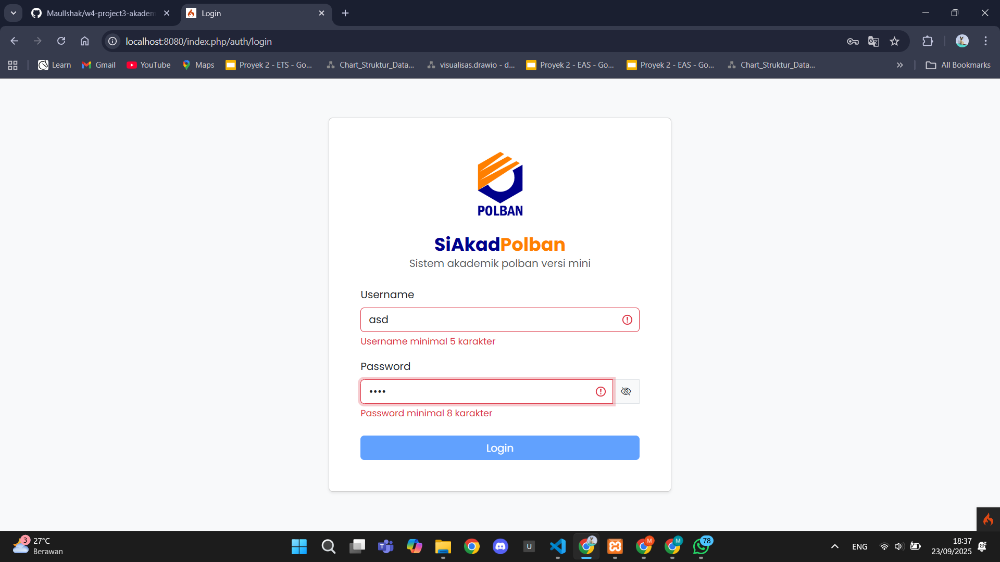
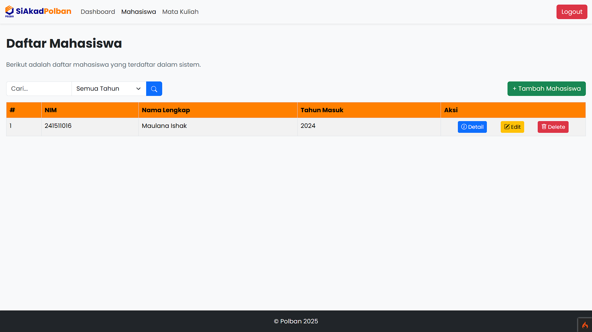
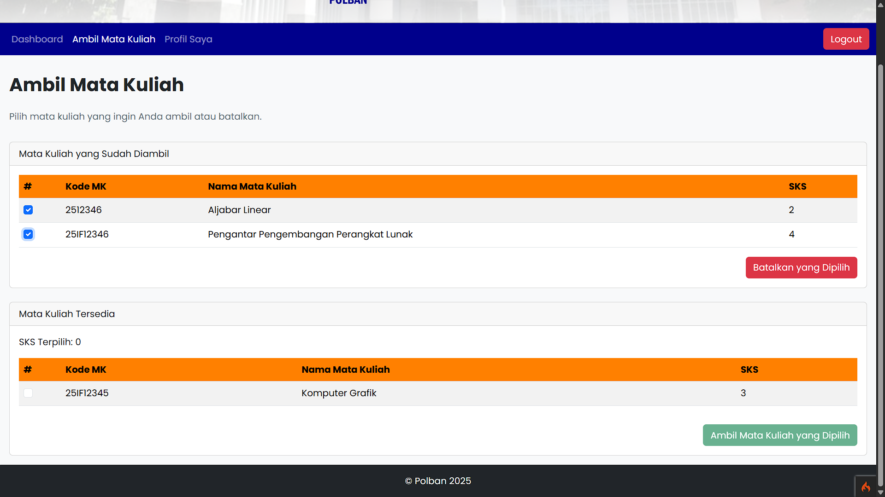

# Sistem Akademik

Sistem Akademik Sederhana berbasis web yang dikembangkan menggunakan framework CodeIgniter 4 (CI4). Proyek ini mendemonstrasikan fitur-fitur dasar seperti manajemen data mahasiswa dan mata kuliah.

## Fitur

- **Manajemen Mahasiswa:** Tambah, edit, hapus, dan lihat data mahasiswa.
- **Manajemen Mata Kuliah:** Atur data mata kuliah yang tersedia.
- **Enroll Mata Kuliah:** Mahasiswa dappat mengambil beberapa mata kuliah yang tersedia.

## Teknologi yang Digunakan

- **CodeIgniter 4:** Framework PHP untuk pengembangan aplikasi web.
- **PHP:** Bahasa pemrograman utama.
- **MySQL:** Database untuk penyimpanan data.
- **Bootstrap:** Untuk tampilan antarmuka yang responsif.
- **Composer:** Manajemen dependensi PHP.

## Instalasi & Cara Menggunakan

1. **Clone Repository**
   ```
   git clone https://github.com/MaulIshak/w4-project3-akademik.git
   ```

2. **Masuk ke direktori proyek**
   ```
   cd w4-project3-akademik
   ```

3. **Install dependency dengan Composer**
   ```
   composer install
   ```

4. **Copy file environment**
   ```
   cp env .env
   ```
   Lalu, sesuaikan konfigurasi database di file `.env`.

5. **Buat database MySQL sesuai konfigurasi**
   ```
   CREATE DATABASE nama_database;
   ```

6. **Jalankan migrasi untuk membuat tabel-tabel yang diperlukan**
   ```
   php spark migrate
   ```

7. **Menjalankan aplikasi**
   ```
   php spark serve
   ```
   Akses aplikasi melalui browser di [http://localhost:8080](http://localhost:8080).

## Tangkapan Layar

### Proses Login
* **Login Gagal (Invalid)**
    
* **Login Berhasil (Valid)**
    

### Dasbor
* **Dasbor Admin**
    
* **Dasbor Mahasiswa**
    

### Manajemen Mahasiswa (Admin)
* **Tabel Mahasiswa**
    
* **Tambah Mahasiswa (Form Valid)**
    
* **Tambah Mahasiswa (Form Invalid)**
    
* **Tambah Mahasiswa (Sukses)**
    
* **Modal Hapus Mahasiswa**
    
* **Hapus Mahasiswa (Sukses)**
    

### Manajemen Mata Kuliah (Admin)
* **Tambah Mata Kuliah (Form Valid)**
    
* **Tambah Mata Kuliah (Form Invalid)**
    
* **Tambah Mata Kuliah (Sukses)**
    
* **Modal Hapus Mata Kuliah**
    
* **Hapus Mata Kuliah (Sukses)**
    

### Pengambilan Mata Kuliah (Mahasiswa)
* **Memilih Mata Kuliah untuk Diambil**
    
* **Ambil Mata Kuliah (Sukses)**
    
* **Memilih Mata Kuliah untuk Dibatalkan**
    
* **Modal Batal Mata Kuliah**
    
* **Batal Mata Kuliah (Sukses)**
    

### Reset Password (Mahasiswa)
* **Reset Password (Form Valid)**
    
* **Reset Password (Form Invalid)**
    
* **Reset Password (Sukses)**
    

## Lisensi

Proyek ini menggunakan lisensi MIT.
